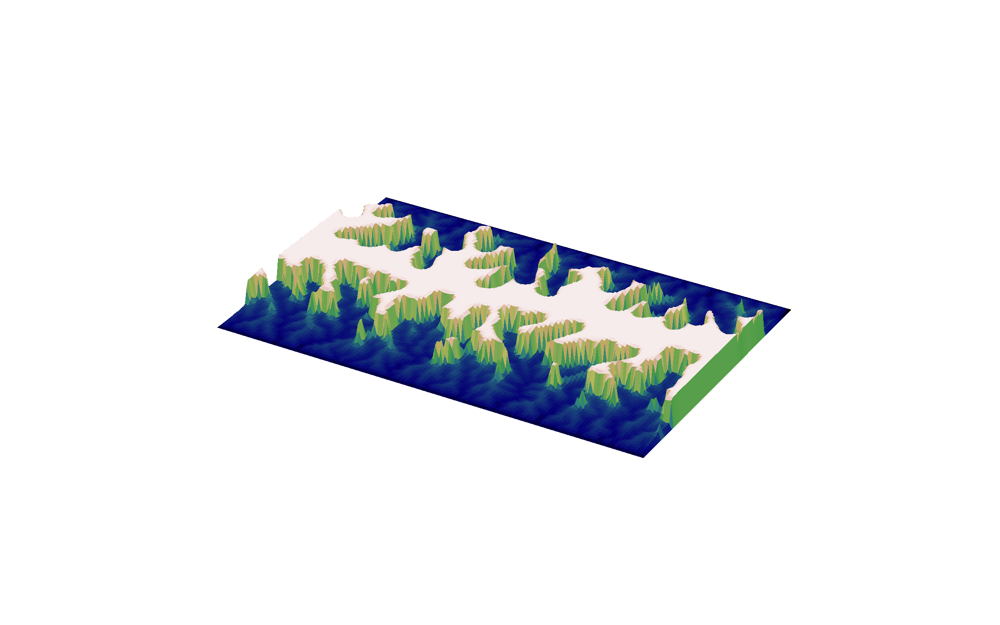
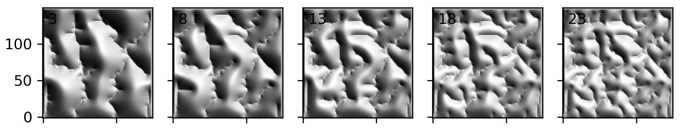
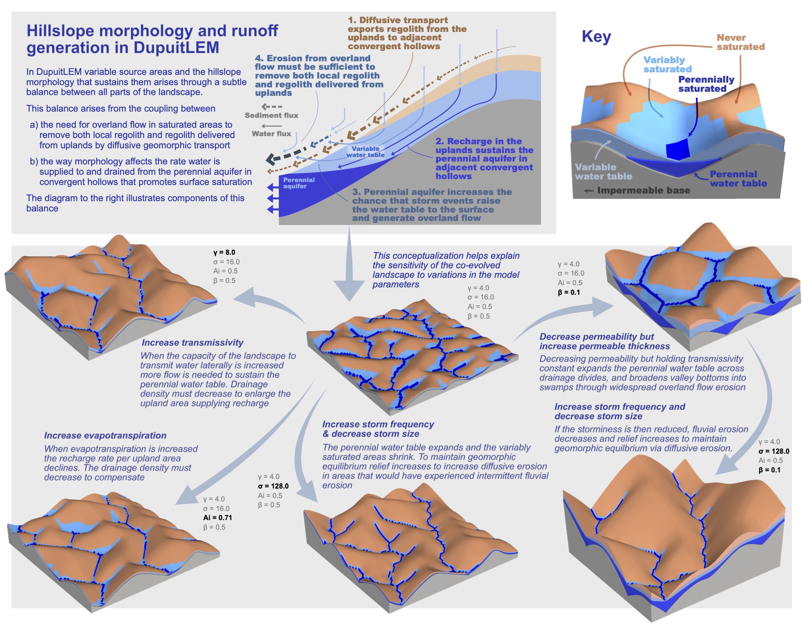
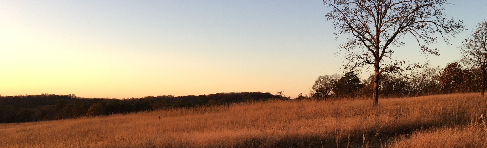

# About Me
I am an assistant professor of instruction in [Earth and Environmental Science](https://cst.temple.edu/research-priorities-departments/departments/department-earth-environmental-science){:target="_blank"} at Temple University in Philadelphia. Previously, I was a postdoctoral researcher at GFZ Helmholtz Center for Geosciences in Potsdam, Germany. I completed my Ph.D. in environmental engineering at Johns Hopkins University in Baltimore, Maryland in 2023, and have undergraduate degrees in civil engineering and music performance from University of Illinois at Urbana-Champaign. 

I study how water moves through and affects Earth’s critical zone (CZ), which extends from the bottom of the circulating groundwater to the top of the vegetation canopy. My work combines theory, numerical simulations, and field measurements to improve our understanding of fundamental processes and management of the CZ, considering both modern environmental change and long-term evolution. I am also a dedicated teacher of hydrology and core skills in our field, including data analytics and scientific writing.

 

# Current Research
### *Groundwater and the persistence of karst landscapes*
 
Carbonate landscapes often have poorly developed river networks, but are instead incredibly well drained by karst features through the bedrock iteself. This leads to challenges in hydrological characterisation, but also breaks conventional understanding of geomorphic response to tectonic signals, which are primarily transmitted by river networks. I am exploring these controls using reduced complexity landscape evolution and groundwater flow models. 

### *Groundwater and geomorphic dynamics at hillslope-scale*
Ongoing projects in this area include collaborations on the role of groundwater in soil creep and sub-critical deformation, and the role of groundwater in the formation of regularly-spaced hillslope features called water tracks in permafrost landscapes. 

### Research availability and collaboration
Piqued your interest? Please [get in touch!](https://cst.temple.edu/directory/david-litwin){:target="_blank"}. Undergraduates at Temple who are interested in research projects that relate to hydrology or surface processes should reach out to me to discuss their interests and current projects that are available. Many things don't appear on this website yet. 

# Completed Research

### *Channel-hillslope coupling in landscape evolution models*
Channel-hillslope models that combine streampower erosion and diffusion are ubiquitous in the geomorphic literature. The channel and hillslope component models each have particular sets of assumptions about how sediment behaves. Can these assumptions be maintained when they are coupled together? Our paper is available [here](https://esurf.copernicus.org/articles/13/277/2025/){:target="_blank"}.

### *Coevolution of topography and runoff generation*
 
Topography affects how water is stored and released from watersheds, while over long timescales, flowing water shapes topography through erosion and incision of channel networks. In humid climates, most storm runoff is groundwater, even in large storms. Typical landscape evolution models do not account for this crucial role of subsurface flow. To investigate the coevolution of topography and runoff generation, I coupled hydrological and landscape evolution models and found that hillslope length scales nonlinearly with subsurface transmissivity (depth-integrated hydraulic conductivity) under the influence of steady recharge. The paper is available [here](https://www.doi.org/10.1029/2021JF006239){:target="_blank"}.

### *The emergence of variable source area hydrology*
 
Here I continued the exploration of coevolved topography and runoff generation, focusing on the emergent dynamics of saturated areas, which are the result of interplay between topography, subsurface properties, and climate. Our work suggests that coevolution may explain variation between these factors observed in the field. We explore this topic in this extensive paper [here](https://doi.org/10.1029/2023WR034647){:target="_blank"}.

### *Evidence of subsurface control on the coevolution of hillslope morphology and runoff generation*
 
Our modelling work suggested that transmissivity of the subsurface is a primary control on runoff generation and topographic evolution. I tested the applicability and limits of our model by comparison with field data from two small watersheds, including new measurements of saturated areas. We also developed a method to use topography, discharge, and saturation data to estimate transmissivity. The paper is available [here](https://onlinelibrary.wiley.com/doi/abs/10.1029/2024WR037301){:target="_blank"}.

 

# Publications
Publications can be found on [Google Scholar](https://scholar.google.com/citations?user=OSuUO6kAAAAJ){:target="_blank"}, [ResearchGate](https://www.researchgate.net/profile/David-Litwin){:target="_blank"}, or [ORCID](https://orcid.org/
0000-0002-8097-4029){:target="_blank"}.

 

# Computational tools
I've built tools for my work that I hope can also benefit the Earth science community. All are open-source, most are well-documented and have extensive unit tests.
* [DupuitLEM](https://github.com/DavidLitwin/DupuitLEM)\
  Modular modeling toolkit for groundwater-driven landscape evolution built with [Landlab](landlab.readthedocs.io/) tools.
* [Karst LEM](https://github.com/DavidLitwin/karst-lem)\
  Simple approaches to carbonate landscape evolution with groundwater in Landlab.
* [GroundwaterDupuitPercolator](https://landlab.readthedocs.io/en/latest/generated/api/landlab.components.groundwater.dupuit_percolator.html)\
  Landlab component for shallow groundwater flow.
* [HeightAboveDrainageCalculator](https://landlab.readthedocs.io/en/latest/generated/api/landlab.components.hand_calculator.hand_calculator.html)\
  Landlab component for calculating the height above the nearest drainage point.
* [Spectral solution for hillslope diffusion](https://github.com/DavidLitwin/SpectralDiffusion)\
  An implicit-spectral solution to hillslope evolution using Landlab tools.

 

# Curriculum Vitae
My C.V. is [here](assets/docs/DavidLitwinCV.pdf){:target="_blank"}.

 

# Teaching
* [Temple University](https://cst.temple.edu/research-priorities-departments/departments/department-earth-environmental-science)\
  Environmental Senior Seminar (Fall 2025)\
  Elements of Data Science (Fall 2025)
* [Johns Hopkins University](https://publichealth.jhu.edu/departments/environmental-health-and-engineering)\
  Gateway Computing: Python (Spring 2021, TA)\
  Hydrology (Fall 2018, Spring 2020, TA)\
  Critical Zone Science Seminar (Spring 2019)

 

# Interests
I like playing the double bass, climbing (usually plastic) rocks, hiking, reading fiction, and sewing my own clothes.
