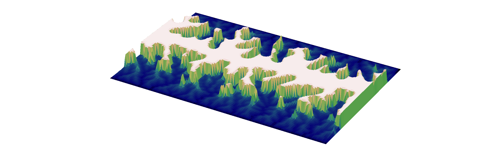

# About Me
I am a postdoctoral researcher at GFZ Potsdam, the German Research Center for Geosciences, in the [Earth Surface Process Modelling](https://www.gfz-potsdam.de/en/section/earth-surface-process-modelling/overview){:target="_blank"} section. I completed my Ph.D. in environmental engineering at Johns Hopkins University in Baltimore, Maryland in 2023. Previously, I received bachelor's degrees in civil engineering and music performance (separately, to be clear) from the University of Illinois at Urbana-Champaign in 2018. These days I use my engineering training to answer Earth science questions, predominantly thinking about interactions between hydrology and geomorphology at the landscape scale. My current work focuses on the interplay between groundwater flow, subsurface structure, and geomorphic change in karst landscapes. My toolkit includes purpose-built numerical models, digital elevation data, and hydro-geomorphic field data, with occasional forays into near-surface geophysics.

 

# Current Research
### *The Birth and Death of Karst Landscapes*
 
Carbonate landscapes often have poorly developed river networks, but are instead incredibly well drained by karst features through the bedrock iteself. This leads to challenges in hydrological characterisation, but also breaks conventional understanding of geomorphic response to tectonic signals, which are primarily transmitted by river networks. I am exploring these controls using reduced complexity landscape evolution, groundwater flow, and karst evolution models. Lecture at Cargese Flow and Transport Summer School coming soon on YouTube.

### *Channel-hillslope coupling in landscape evolution models*
Channel-hillslope models that combine streampower erosion and diffusion are ubiquitous in the geomorphic literature. The channel and hillslope component models each have particular sets of assumptions about how sediment behaves. Can these assumptions be maintained when they are coupled together? A preprint of this work will be out soon.  

#### Looking for collaborations!
Piqued your interest? Please [get in touch!](https://www.gfz-potsdam.de/en/staff/david.litwin/sec47){:target="_blank"}

# Doctoral Research
### *Understanding the coevolution of topography and runoff generation*
 
Topography affects how water is stored and released from watersheds, while over long timescales, flowing water shapes topography through erosion and incision of channel networks. In humid climates, most storm runoff is groundwater, even in large storms. Typical landscape evolution models do not account for this crucial role of subsurface flow. To investigate the coevolution of topography and runoff generation, I coupled hydrological and landscape evolution models and found that hillslope length scales nonlinearly with subsurface transmissivity (depth-integrated hydraulic conductivity) under the influence of steady recharge. The paper is available [here](https://www.doi.org/10.1029/2021JF006239){:target="_blank"}.

### *The emergence of variable source area hydrology*
 
Here I continued the exploration of coevolved topography and runoff generation, focusing on the emergent dynamics of saturated areas, which are the result of interplay between topography, subsurface properties, and climate. Our work suggests that coevolution may explain variation between these factors observed in the field. We thoroughly explore this topic in this extensive paper [here](https://doi.org/10.1029/2023WR034647){:target="_blank"}.

### *Evidence of subsurface control on the coevolution of hillslope morphology and runoff generation*
 
Our modelling work suggested that transmissivity of the subsurface is a primary control on runoff generation and topographic evolution. I tested the applicability and limits of our model by comparison with field data from two small watersheds, including new measurements of saturated areas. We also developed a method to use topography, discharge, and saturation data to estimate transmissivity. A preprint is available [here](https://doi.org/10.22541/au.170869979.95102763/v1){:target="_blank"}.

 

# Past Research
### *Drainage divide dynamics when point sinks set baselevel*
Steady-state drainage divides fall along the edges of Voronoi polygons separating point sinks, illuminating more general behavior of a simple landscape evolution model.

### *Understanding controls on the form of flow duration curves*
Mean fluxes, including baseflow, quickflow, and streamflow, alone explain quantiles in the flow duration curve across many environmental settings, suggesting emergent behavior of watersheds.

### *Using electrical resistivity tomography to recover soil properties in a lysimeter*
Soil properties at the Landscape Evolution Observatory in Arizona vary in space and may change with time. Theoretical modeling revealed the impact of measurement noise on our ability to determine soil porosity from ERT surveys.

 

# Publications
Publications can be found on [Google Scholar](https://scholar.google.com/citations?user=OSuUO6kAAAAJ){:target="_blank"}, [ResearchGate](https://www.researchgate.net/profile/David-Litwin){:target="_blank"}, or [ORCID](https://orcid.org/
0000-0002-8097-4029){:target="_blank"}.

 

# Computational tools
I've built tools for my work that I hope can also benefit the Earth science community. All are open-source, most are well-documented and have extensive unit tests.
* [DupuitLEM](https://github.com/DavidLitwin/DupuitLEM)\
  Modular modeling toolkit for groundwater-driven landscape evolution built with [Landlab](landlab.readthedocs.io/) tools.
* [GroundwaterDupuitPercolator](https://landlab.readthedocs.io/en/master/reference/components/groundwater.html)\
  Landlab component for shallow groundwater flow.
* [HeightAboveDrainageCalculator](https://landlab.readthedocs.io/en/master/reference/components/hand_calculator.html)\
  Landlab component for calculating the height above the nearest drainage point.
* [Spectral solution for hillslope diffusion](https://github.com/DavidLitwin/SpectralDiffusion)\
  An implicit-spectral solution to hillslope evolution using Landlab tools.

 

# Curriculum Vitae
My C.V. is [here](assets/docs/DavidLitwinCV.pdf){:target="_blank"}.

 

# Science Communication and Service
* [Water Underground](https://blogs.egu.eu/network/water-underground/){:target="_blank"}\
I co-edited of the Water Underground blog hosted by the American Geophysical Union and the European Geosciences Union.
* [Geobites](https://geobites.org/author/dlitwin/){:target="_blank"}\
I have written summaries of peer-reviewed hydrology and geomorphology articles for science-curious audiences.
* [American Geophysical Union Hydrology Section Student Subcommittee (H3S)](agu-h3s.org/){:target="_blank"}\
I served on H3S for the two year term 2020-2021, helping to establish their website and blog.

 

# Interests
I like playing the double bass, climbing (usually plastic) rocks, hiking, reading fiction, and sewing my own clothes.
